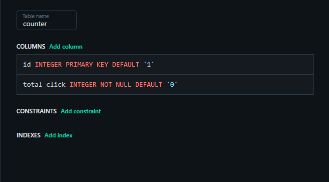

# Group2---button-counter
 Creating a simple button-counter UI with SvelteKit for front-end, TypeScript as part of back-end integration, and Turso for database. 
 
 This project aims for simulating a real-world working environment, be able to collaborate with team members, understanding client requirements, and write documentation.
 
 This group project's README.md is intentionally designed as a guildline to ensure all team members have leverage access to shared resources and can stay aligned and work efficiently.

<details>
<summary><h2>🛠️ TypeScript Setup</h2></summary> 
  
### ⚠️ Prerequisite  
---
  [Node.js installation](https://nodejs.org/en/download/current)

  To confirm it properly installed run: `node -v` then `npm -v`

<br>
  
### 📥 Typescript Installation
---
```bash
npm install -g typescript
```
This will be installed globally allowing you to execute `tsc` command anywhere in your terminal.

To confirm it properly installed run: `tsc -v`

</details>

<details>
<summary><h2>⚙️ Backend Configuration</h2></summary> 

This is where front-end requests to fetch data from database. Since we are using **Turso** as database, an authentication is needed to be stored safely in `.env` file. We need a hosting server **Express** to handle API/route, and browser traffic control (HTTP request) **CORS**.

```bash
npm init -y
npm i express cors dotenv @libsql/client
npm i -D typescript @types/node @types/express @types/cors
npx tsc --init
```
<br>

### 🔧 tsconfig.json 

Add:
```md
"moduleResolution": "nodenext",
```

Change: 
```md
"target": "esnext",     ➡️ "target": "es2020",

"types": [],            ➡️ "types": ["node"],

"declaration": true,    ➡️ "declaration": false,

"declarationMap": true, ➡️ "declarationMap": false,
```

<br>

💭*Optional*

If you prefer to work on a clean structural folder do consider uncomment / enable this:
```md
// "rootDir": "./src",
// "outDir": "./dist",
```
* All `.ts` files are stored in **src folder**
* Everytime you compile file to `.js`, those files will be stored in **dist folder** automatically.

<br>

### 🔧 package.json

Under scripts variable, add: 
```md
"build": "tsc",
"start": "node ./dist/server.js",
```

Change: 
```md
"type": "commonjs", ➡️ "type": "module",
```

<br>

### 🔧 Creat `.env` file
This is where you store your credential token and url from Turso. 
Simply create a file in your project and name `.env` or create via command:

**Window:**
```bash
ni .env
```
**macOS / Linux**
```bash
touch .env
```
Copy this into your `.env` file.

```md
# Environment variables for Turso database connection
TURSO_DATABASE_URL= <YOUR TURSO ACCOUNT URL>
TURSO_AUTH_TOKEN= <YOUR TOKEN>
PORT=3000

```

⚠️**Note:** create `.gitignore` file and paste this:
```md
.env
node_modules/
dist/   ⬅️ if you have dist folder
```
This prevent credential data, unnecessary modules, or back-end configuration from being push the github public repository.

<br>

### 🔧 Create `server.ts` file
This is where your back-end communicate with database. Paste this:
```ts
import "dotenv/config";
import express from "express";
import cors from "cors";
import path from "path";
import { fileURLToPath } from "url";
import { createClient } from "@libsql/client";

const app = express();
app.use(cors());
app.use(express.json());

// Serve frontend files (index.html, style.css, main.js)
const __filename = fileURLToPath(import.meta.url);
const __dirname = path.dirname(__filename);
app.use(express.static(path.join(__dirname, ".."))); ⬅️//if you don't have dist folder, please delete ".."

// Initialize Turso database client
const db = createClient({
  url: process.env.TURSO_DATABASE_URL!,
  authToken: process.env.TURSO_AUTH_TOKEN!,
});

// 1) Get current count
app.get("/api/count", async (_req, res) => {
  const result = await db.execute(
    "SELECT total_click FROM counter WHERE id = 1");
  const value = Number(result.rows[0]?.total_click ?? 0);
  res.json({ value });
});

// 2) Increment count + return new value
app.post("/api/increment", async (_req, res) => {
  await db.execute(
    "UPDATE counter SET total_click = total_click + 1 WHERE id = 1");

  const result = await db.execute(
    "SELECT total_click FROM counter WHERE id = 1");
  const value = Number(result.rows[0]?.total_click ?? 0);

  res.json({ value });
});

// Start server on port 3000
const port = Number(process.env.PORT ?? 3000);
app.listen(port, () => {
  console.log(`Server running at http://localhost:${port}`);
});

```
⚠️**Note:** if you ever encounter modules / libraries being undefined, make sure you follow `tsconfig.json` and `package.json` setup.

</details>

<details>
<summary><h2>📊 Turso Database Connection</h2></summary> 

- Go to [Turso](https://turso.tech/) and create account
- ➡️ **Create Database** ➡️ In **Overview** tab, copy the url and create your token which are needed in `.env` file.
- ➡️ Go to your database **Edit Data**, click plus button to create a table, then setup all necessary columns requirements.

In this project case: 
<p align="center">
  
</p>

- On Turso, open **SQL Console** (top-right corner) and insert the following command to initiate the first row values:
```sql
INSERT INTO counter (id, total_click)
VALUES (1, 0);
```
</details>

<details>
<summary><h2>🖼️ SvelteKit Integration</h2></summary> 
</details>

<details>
<summary><h2>🗺️ Code Execution and Flowchart</h2></summary> 

Once you have done with new changes, execute the following commands:
```bash
npm run build
npm run start
```
`npm run build` will compile all `.ts` files into `.js` inside **dist** folder (if you are using **dist** structure option)

After `npm run start` click the provided url that looks like this  http://localhost:3000 This is the hosting server from `server.js`

<br>

💭*Optional*

If you prefer to work on development mode that automatically compiles on live when working on `.ts` files, in your terminal install `nodemon`:
```bash
npm install -D nodemon
```

After that, in `package.json` file under scripts variabes, add:

```md
"dev": "tsc -w & nodemon dist/server.js"
```

Now it will recompile on change by executing:

```bash
npm run dev
```

<br>

*💡 Useful Tips* : If you want to compile a specific file:

```bash
tsc <file-name>
```

<br>

### 🗺️ Flowchart

```txt
[ User : Click the button]
   |
   v
[ Frontend ]
   |
   |  HTTP Request
   v
[ Backend Server ]
   |
   |  SQL Query
   v
[ Turso Database ]
   |
   |  Result
   v
[ Backend Server ]
   |
   |  JSON Response
   v
[ Frontend ]
   |
   v
[ Updated Count Displayed ]
```
</details>


